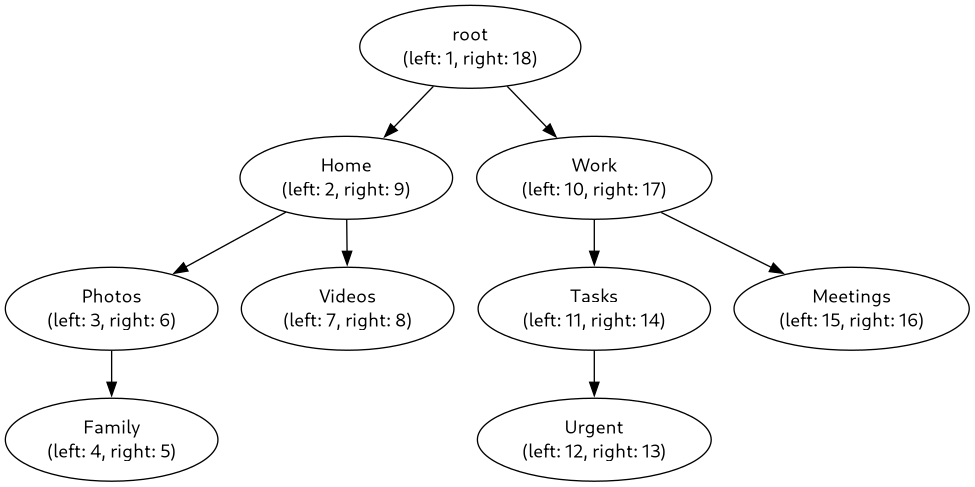

# tree-visualization

Display a graphic tree

tree-visualization is a Go-based tool that transforms a hierarchical folder structure into a Graphviz DOT file and generates an image representation (e.g., PNG, SVG) via an API. The project is containerized using Docker for easy deployment across systems.

## Features

- Accepts a JSON input representing a folder structure with `id`, `display_name`, `parent_id`, `node_left`, and `node_right`.
- Generates a Graphviz DOT representation of the folder hierarchy.
- Converts the DOT file into an image (e.g., PNG, SVG) using Graphviz.
- Provides a RESTful API endpoint for easy integration.
- Dockerized for portability—no local dependencies required.

## Project Structure

tree-visualization/
├── Dockerfile
├── LICENSE
├── README.md
├── go.mod
├── go.sum
├── main.go
├── models
│   └── node.go
├── routers
│   └── api.go
├── test_case_1.png
├── test_case_2.png
├── test_case_3.png
└── utils
    └── dot.go

## Prerequisites

- Docker (for containerized deployment)
- (Optional) Go 1.21+ and Graphviz (for local development)

## Installation

### Using Docker

1. Using Docker

```bash
git clone https://github.com/henry0hai/tree-visualization.git
cd tree-visualization
```

2. Build the Docker image

```bash
docker build -t tree-visualization .
```

3. Run the container

```bash
docker run -p 8080:8080 tree-visualization
```

- The API will be available at http://localhost:8080.

### Local Development (Optional)

1. Install Go 1.23+ and Graphviz:  

   * Go: [Official Go Installation](https://go.dev/doc/install)
   * Graphviz: `sudo apt install graphviz` (Ubuntu) or `brew install graphviz` (macOS)

2. Clone the repository and navigate to the project directory.

3. Install dependencies:

```bash
go mod tidy
```

4. Run the application

```bash
go run main.go
```

## Usage

### API Endpoint

- Endpoint: `POST /generate`
- Content-Type: `application/json`
- Request Body:

```JSON
{
    "nodes": [
        {"id": 1, "display_name": "root", "parent_id": null, "node_left": 1, "node_right": 20},
        {"id": 2, "display_name": "Documents", "parent_id": 1, "node_left": 2, "node_right": 3}
    ],
    "format": "png"
}
```

- Response: Binary image data (e.g., PNG, SVG) based on the specified format.

### Example Request

- Save the JSON to a file (e.g., input.json) and use curl:

```bash
curl -X POST -H "Content-Type: application/json" -d @input.json http://localhost:8080/generate --output output.png
```

### Test Cases

Below are sample inputs to test the application. Each represents a different folder structure.

#### Test Case 1: Original Example

```JSON
{
    "nodes": [
        {"id": 1, "display_name": "root", "parent_id": null, "node_left": 1, "node_right": 20},
        {"id": 2, "display_name": "Documents", "parent_id": 1, "node_left": 2, "node_right": 3},
        {"id": 3, "display_name": "Videos", "parent_id": 1, "node_left": 4, "node_right": 5},
        {"id": 4, "display_name": "Photos", "parent_id": 1, "node_left": 6, "node_right": 15},
        {"id": 5, "display_name": "Workspace", "parent_id": 1, "node_left": 16, "node_right": 17},
        {"id": 6, "display_name": "Personal", "parent_id": 1, "node_left": 18, "node_right": 19},
        {"id": 7, "display_name": "Camera", "parent_id": 4, "node_left": 7, "node_right": 10},
        {"id": 8, "display_name": "Demo_1", "parent_id": 7, "node_left": 8, "node_right": 9},
        {"id": 9, "display_name": "Screenshot", "parent_id": 4, "node_left": 11, "node_right": 12}
    ],
    "format": "svg"
}
```


### Test Case 2: Deep Nested Structure

```JSON
{
    "nodes": [
        {"id": 1, "display_name": "root", "parent_id": null, "node_left": 1, "node_right": 14},
        {"id": 2, "display_name": "Projects", "parent_id": 1, "node_left": 2, "node_right": 13},
        {"id": 3, "display_name": "Work", "parent_id": 2, "node_left": 3, "node_right": 12},
        {"id": 4, "display_name": "2025", "parent_id": 3, "node_left": 4, "node_right": 11},
        {"id": 5, "display_name": "Q1", "parent_id": 4, "node_left": 5, "node_right": 10},
        {"id": 6, "display_name": "Reports", "parent_id": 5, "node_left": 6, "node_right": 7},
        {"id": 7, "display_name": "Drafts", "parent_id": 5, "node_left": 8, "node_right": 9}
    ],
    "format": "png"
}
```


### Test Case 3: Complex Tree with Multiple Branches

```JSON
{
    "nodes": [
        {"id": 1, "display_name": "root", "parent_id": null, "node_left": 1, "node_right": 18},
        {"id": 2, "display_name": "Home", "parent_id": 1, "node_left": 2, "node_right": 9},
        {"id": 3, "display_name": "Work", "parent_id": 1, "node_left": 10, "node_right": 17},
        {"id": 4, "display_name": "Photos", "parent_id": 2, "node_left": 3, "node_right": 6},
        {"id": 5, "display_name": "Videos", "parent_id": 2, "node_left": 7, "node_right": 8},
        {"id": 6, "display_name": "Family", "parent_id": 4, "node_left": 4, "node_right": 5},
        {"id": 7, "display_name": "Tasks", "parent_id": 3, "node_left": 11, "node_right": 14},
        {"id": 8, "display_name": "Meetings", "parent_id": 3, "node_left": 15, "node_right": 16},
        {"id": 9, "display_name": "Urgent", "parent_id": 7, "node_left": 12, "node_right": 13}
    ],
    "format": "png"
}
```



## Notes

- The `node_left` and `node_right` values follow the nested set model for hierarchical representation.
- Supported image formats include `png`, `svg`, `jpg`, etc., depending on Graphviz capabilities.
- For local testing without Docker, ensure Graphviz is installed.

## Contributing

Feel free to submit issues or pull requests to enhance functionality, such as additional input formats or validation checks.

## License

This project is licensed under the MIT License.
